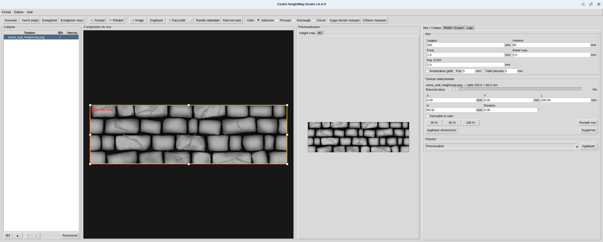
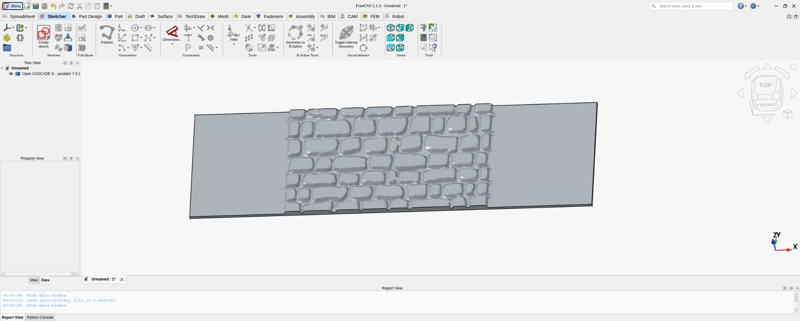

# Castle HeightMap Studio

**Éditeur de textures et de height-maps pour générer des reliefs 3D STEP utilisables directement dans FreeCAD.**

**Version 4.4.3 · Auteur : Valentin Bonali · Windows / Linux · Licence MIT**

Castle HeightMap Studio permet de partir d'une simple image — mur en pierre, briques, gravure, motif décoratif — pour construire une façade texturée aux dimensions réelles, prévisualiser son relief puis l'exporter sous forme de **solide STEP**.

Le logiciel ne se limite pas à une conversion image → relief : il sert aussi de petit éditeur de préparation. Plusieurs textures peuvent être assemblées, déplacées, étirées, raccordées, masquées et réglées avant de générer la géométrie finale.



## Pourquoi ce projet existe

Castle HeightMap Studio est né dans le cadre d'un projet **CDR — Coupe de France de Robotique**.

L'objectif d'origine est très concret : habiller un robot avec une esthétique **château fort / Camelot** tout en continuant à concevoir la mécanique dans **FreeCAD**. Modéliser manuellement des dizaines ou centaines de pierres sur toutes les façades aurait été long, répétitif et pénible à modifier.

Le logiciel sert donc à transformer rapidement une texture 2D en une vraie géométrie CAO :

```text
Image / texture
      ↓
Composition des calques
      ↓
Height-map
      ↓
Relief 3D
      ↓
STEP
      ↓
FreeCAD
      ↓
Pièce finale / impression 3D
```

Même si le projet vient de la robotique, l'outil est volontairement général : il peut servir pour des **décors, maquettes, boîtiers, façades, plaques gravées, murs miniatures ou pièces imprimées en 3D**.

## Fonctionnalités principales

- **Composition multi-calques** avec déplacement et redimensionnement libre.
- Position et dimensions précises en **millimètres**.
- Rotation, verrouillage du ratio et grille magnétique.
- Raccord automatique, raccord doux et duplication miroir pour prolonger une texture.
- Création de textures répétables.
- Réglages de height-map : HSV, contraste, niveaux noir/blanc, gamma et lissage.
- Presets pour pierre douce, pierre marquée et gravure.
- **Masques pinceau, rectangle et cercle/ellipse** pour conserver des zones parfaitement planes.
- Aperçu 2D de la composition.
- Aperçu de la height-map.
- **Aperçu 3D intégré**.
- Export d'un **vrai solide STEP** via CadQuery / OpenCascade.
- Export STEP multi-corps optionnel `Mur_complet` + `Base_reference` dans le même repère.
- Résolution STEP adaptative sécurisée avec contrôle anti-overshoot.
- Sauvegarde de projets `.castlehm`.
- Undo / Redo.
- Aide intégrée sous forme de mini-wiki.
- Changelog intégré.
- Vérification des nouvelles versions via GitHub Releases.
- Builds `.exe` Windows et `.AppImage` Linux.

## Exemple CDR inclus

Un vrai projet `.castlehm` d'exemple est fourni dans :

```text
examples/cdr_castle_wall_example.castlehm
```

Une copie portant le nom original est également présente :

```text
examples/CDR.castlehm
```

Au **premier lancement**, Castle HeightMap Studio charge automatiquement cet exemple et affiche un écran d'accueil expliquant le workflow.

L'exemple peut être rechargé à tout moment avec :

```text
Fichier → Ouvrir l'exemple CDR
```

## Workflow FreeCAD

L'export optionnel avec corps de référence génère un seul STEP contenant :

```text
Mur_complet
Base_reference
```



Les deux corps utilisent exactement le même système de coordonnées. Dans FreeCAD, on peut donc récupérer uniquement le relief par une opération booléenne :

```text
Relief = Cut(Mur_complet, Base_reference)
```

Aucun recalage manuel des deux corps n'est nécessaire.


## Correctif AppImage

La v4.4.2 corrige un bug de rendu rencontré uniquement dans l’AppImage :

```text
No module named 'PIL._tkinter_finder'
```

Cause : le pont Tk de Pillow (`PIL.ImageTk` / `PIL._tkinter_finder`) n’était pas collecté correctement dans le binaire packagé, alors que le lancement via `./run.sh` utilisait bien l’environnement Python complet.

Correctif appliqué :
- ajout de `--collect-submodules PIL`
- ajout de `--hidden-import PIL.ImageTk`
- ajout de `--hidden-import PIL._tkinter_finder`
- ajout d’un self-test dédié `pillow/tk` sur le binaire final

## Installation rapide

### Windows — mode Python

Double-cliquer sur :

```text
install_windows.bat
```

Puis :

```text
run_windows.bat
```

### Linux / Zorin / Ubuntu — mode Python

```bash
chmod +x install_linux.sh run.sh
./install_linux.sh
./run.sh
```

## Version « logiciel » : EXE et AppImage

Le dépôt contient maintenant des scripts de build et un workflow GitHub Actions.

### Construire l'EXE sous Windows

```text
build_windows.bat
```

Le résultat est placé dans :

```text
dist/CastleHeightMapStudio.exe
```

### Construire l'AppImage sous Linux

```bash
chmod +x build_appimage.sh
./build_appimage.sh
```

Le résultat attendu est :

```text
dist/CastleHeightMapStudio-x86_64.AppImage
```

### GitHub Actions

Le fichier :

```text
.github/workflows/build-release.yml
```

construit automatiquement :
- le `.exe` Windows ;
- l'`.AppImage` Linux ;
- une archive source.

Sur un tag Git tel que `v4.2`, le workflow peut également publier les fichiers dans **GitHub Releases**.

## Mise à jour

Le menu :

```text
Aide → Rechercher les mises à jour
```

utilise l'API publique GitHub Releases.

Le dépôt est détecté automatiquement depuis :
1. `update_config.json` ;
2. la variable `GITHUB_REPOSITORY` ;
3. le remote `origin` Git.

Lors d'un build GitHub Actions, `update_config.json` est automatiquement renseigné avec le vrai dépôt.

Le logiciel télécharge la nouvelle version mais ne remplace pas silencieusement l'exécutable en cours : il laisse l'utilisateur lancer le nouveau fichier.

## Menus

### Fichier
- Nouveau
- Ouvrir
- Enregistrer
- Enregistrer sous
- Export PNG
- Export STEP
- Quitter

### Édition
- Annuler / Rétablir
- Ajouter une texture
- Dupliquer
- Supprimer

### Aide
- Aide
- Changelog
- Rechercher les mises à jour
- À propos

## À propos

La fenêtre À propos affiche notamment :
- version ;
- auteur ;
- système ;
- architecture ;
- Python ;
- Tk ;
- NumPy ;
- Pillow ;
- Matplotlib ;
- CadQuery ;
- dépôt GitHub détecté.

## Documentation

L'aide intégrée est maintenant organisée comme un mini-wiki :

- `docs/wiki_index.json`
- `docs/wiki/*.md`
- `docs/CHANGELOG.md`

Le logiciel possède son propre rendu Markdown pour les titres, listes, gras,
italique, blocs de code et liens cliquables.

## Exemple

L'image demandée est fournie :
- `smoke_test_heightmap.png`
- `examples/stone_wall_heightmap.png`

## STEP FreeCAD multi-corps

L'option **Ajouter Base_reference dans le même STEP** conserve les deux solides dans **un seul fichier STEP et le même repère** :

- `Mur_complet`
- `Base_reference`

Dans FreeCAD, `Cut(Mur_complet, Base_reference)` donne le relief seul sans recalage manuel.


## Logs

Les builds packagés n'écrivent jamais dans leur propre dossier.

- Linux : `~/.local/state/CastleHeightMapStudio/castle_heightmap.log`
- Windows : `%LOCALAPPDATA%\CastleHeightMapStudio\castle_heightmap.log`

## Self-test des builds

```bash
CastleHeightMapStudio --self-test
```

GitHub Actions exécute ce test sur les artefacts finaux avant de les publier.


## Packaging CadQuery / CasADi

CadQuery dépend notamment de CasADi. Sous Windows, CasADi contient un module
SWIG natif (`casadi._casadi`) et de nombreuses DLL.

Le build inclut donc :
- `--collect-all casadi`
- `--hidden-import casadi._casadi`
- un hook PyInstaller dédié ;
- un runtime hook Windows qui ajoute le dossier CasADi au chemin de recherche
  des DLL.

Le self-test de release effectue ensuite une vraie création de solide CadQuery
pour vérifier que la pile CadQuery/OpenCascade/CasADi est fonctionnelle.


